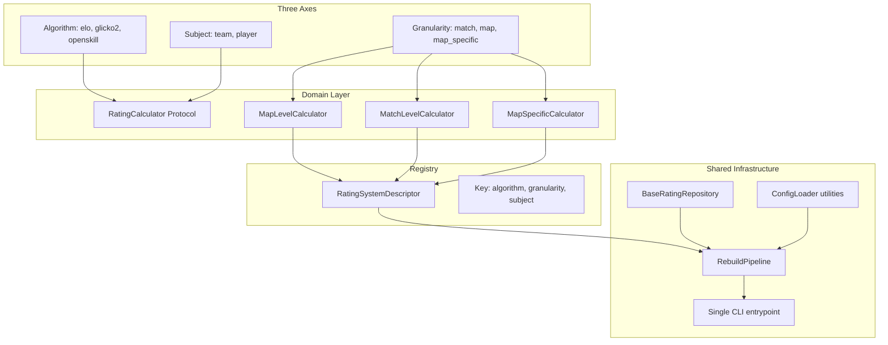

# Rating System Architecture Refactor

## Problem Statement

The current codebase handles 3 algorithms (Elo, Glicko-2, OpenSkill) across multiple granularity levels with no shared abstractions. Today 5 combinations exist, and each requires ~6-8 files with heavily duplicated scaffold code. The system is also entirely team-level, with no clear path to player-level ratings.

## Three-Axis Model

The system decomposes into three independent axes:

- **Algorithm** (elo, glicko2, openskill) -- the rating math
- **Granularity** (match, map, map_specific) -- a spectrum from coarsest to finest tracking
- **Subject** (team, player) -- the entity being rated

### Granularity: A Unified Spectrum

Rather than splitting "what data unit to process" (resolution) from "how to partition state" (scope) into separate axes, we treat them as a single hierarchy of increasing specificity:

- **match** -- coarsest; one rating per entity, updated once per match (aggregated map wins)
- **map** -- finer; one rating per entity, updated once per individual map played
- **map_specific** -- finest; one rating per entity *per map name*, blended with a global rating, updated per map

This is a natural progression. Both `map` and `map_specific` process the same input data (`TeamMapResult`), but `map_specific` maintains richer state (per-map-name ratings, games counts, blend weights). Internally, `map_specific` calculators can still use a decorator/wrapper pattern over `map`-level calculators as an implementation detail -- the blending infrastructure (per-map state, weight calculation, inactivity) is reusable. But this doesn't need to be a separate top-level axis.

### Subject: Team vs Player

The Subject axis affects *what entity* the calculator operates on, not *how* it operates:

- **State keying**: `dict[team_id, rating]` vs `dict[player_id, rating]`
- **Event cardinality**: a map result produces 2 team events vs 10 player events (5v5)
- **Input data**: team-level needs match outcomes; player-level additionally needs individual stats (K/D, ADR) from `map_player_stats`
- **Result interpretation**: for players, how team outcomes are attributed to individuals (e.g., weighted by performance, or pure win/loss)
- **Models/tables**: `team_elo` vs `player_elo` (different FK column)
- **Data fetching**: `fetch_map_results` vs a new `fetch_player_map_results` that joins player stats

What does NOT change across subjects: algorithm math, granularity logic, repository CRUD scaffold, config loading, rebuild pipeline, CLI structure.

### Valid Combinations

```
               team    player
match            Y        Y
map              Y        Y
map_specific     Y        Y
```

All 9 combinations are valid in principle. Current coverage (all subject=team):

- elo + map + team (TeamEloCalculator)
- elo + match + team (TeamMatchEloCalculator)
- elo + map_specific + team (TeamMapSpecificEloCalculator)
- glicko2 + map + team (TeamGlicko2Calculator)
- openskill + map + team (TeamOpenSkillCalculator)

### Player-Level: Design Now, Implement Later

Player-level is not implemented in Phases 1-5 -- the architecture just needs to **not preclude it**. Concretely:

- Protocols are parameterized on result type (not hardcoded to `TeamMapResult`)
- The registry key includes subject
- The `BaseRatingRepository` uses a configurable entity FK column name, not a hardcoded `team_id`
- `process_map` / `process_match` return `list[E]` (variable length) instead of `tuple[E, E]`

## Design Principles

1. **Composition over inheritance** -- use Protocols to define contracts, not deep class hierarchies
2. **Keep algorithm math concrete** -- the Elo formula, Glicko-2 update, and OpenSkill model should remain in dedicated, readable modules with no abstraction tax
3. **Extract the scaffold, not the science** -- the parts that are identical across systems (config loading, CRUD, rebuild pipeline, CLI) should be shared; the parts that differ (math, event schemas, parameters) should stay specific
4. **Three orthogonal axes** -- Algorithm, Granularity, and Subject are independent dimensions, not a flat list of "system types"
5. **Design for player-level, implement team-level first** -- the architecture supports both subjects from day one, but player-level calculators and data fetching are added later when needed
6. **Incremental migration** -- each phase can be merged independently and existing behavior verified with the current test suite

## Architecture Overview




## Phase 1: Protocols and Enums

Introduce the three-axis enums and calculator protocols. This is non-breaking -- existing calculators already satisfy the protocols.

**New file: [src/domain/ratings/protocol.py**](src/domain/ratings/protocol.py)

```python
from enum import Enum
from typing import Protocol, TypeVar, runtime_checkable

class Granularity(Enum):
    MATCH = "match"               # coarsest: one rating per entity, updated per match
    MAP = "map"                   # finer: one rating per entity, updated per map
    MAP_SPECIFIC = "map_specific" # finest: one rating per entity per map name, blended with global

class Subject(Enum):
    TEAM = "team"       # rate teams
    PLAYER = "player"   # rate individual players

E = TypeVar("E")  # event type

@runtime_checkable
class RatingCalculator(Protocol[E]):
    """Base contract all calculators satisfy."""
    def tracked_entity_count(self) -> int: ...
    def ratings(self) -> dict[int, float]: ...

@runtime_checkable
class MapLevelCalculator(RatingCalculator[E], Protocol[E]):
    """Granularity.MAP calculators."""
    def process_map(self, result) -> list[E]: ...

@runtime_checkable
class MatchLevelCalculator(RatingCalculator[E], Protocol[E]):
    """Granularity.MATCH calculators."""
    def process_match(self, result) -> list[E]: ...

@runtime_checkable
class MapSpecificCalculator(RatingCalculator[E], Protocol[E]):
    """Granularity.MAP_SPECIFIC calculators. Same input as MAP but richer state."""
    def process_map(self, result) -> list[E]: ...
```

Design choices that keep the architecture subject-aware:

- `tracked_team_count()` becomes `tracked_entity_count()` (works for teams or players)
- `process_map` / `process_match` return `list[E]` instead of `tuple[E, E]`, because player-level produces 10 events per map (5v5) while team-level produces 2
- Result parameter is untyped in the protocol (concrete calculators type it as `TeamMapResult`, `PlayerMapResult`, etc.)

Note that `MapLevelCalculator` and `MapSpecificCalculator` share the same `process_map` signature -- they both consume map results. The difference is internal state management. `map_specific` calculators maintain per-map-name ratings, games counts, and blend weights on top of a global rating. This distinction lives in the implementation, not the protocol.

Internally, `map_specific` implementations can still use a wrapper/decorator over a `map`-level calculator to reuse the blending infrastructure (per-map state tracking, weight calculation, per-map inactivity). This is an implementation pattern, not a top-level axis -- each algorithm that supports `map_specific` can choose whether to use the wrapper or implement it directly.

No changes to existing calculator files -- they already satisfy these protocols.

## Phase 2: Generic Repository Base

Extract the boilerplate CRUD that is identical across all 5+ repositories into a generic base.

**New file: `src/repositories/ratings/base.py**`

Common operations to extract:

- `ensure_schema(engine)` -- reflect + create tables
- `upsert_system(session, name, description, config_json)` -- create-or-update the `*_systems` row
- `delete_events_for_system(session, system_id)` -- delete events belonging to a system
- `insert_events(session, events, system_id)` -- bulk insert with COPY-when-available fallback
- `count_tracked_teams(session, system_id)` -- distinct team count

The base class is generic over the System model, Event model, and domain Event dataclass:

```python
class BaseRatingRepository(Generic[SystemModel, EventModel, DomainEvent]):
    def __init__(
        self,
        system_model: type[SystemModel],
        event_model: type[EventModel],
        system_id_column: str,         # e.g. "elo_system_id"
        entity_id_column: str,         # "team_id" or "player_id" -- subject-agnostic
        event_to_row: Callable[[DomainEvent, int], dict],  # maps domain event -> insert dict
        copy_sql: str | None = None,   # optional COPY statement
        event_to_copy_row: Callable[[DomainEvent, int], tuple] | None = None,
    ): ...
```

The `entity_id_column` parameter ensures the repository is subject-agnostic: `count_tracked_entities()` counts distinct values of whatever column the subject uses (`team_id` for teams, `player_id` for players), without hardcoding either.

Each concrete repository becomes ~20 lines defining the mapping functions and COPY SQL, instead of ~80+ lines of duplicated CRUD. The existing `fetch_map_results` and `fetch_match_results` in [src/repositories/ratings/common.py](src/repositories/ratings/common.py) stay as-is -- they are query logic, not CRUD scaffold.

**Important**: The duplicate `fetch_map_results` in [src/repositories/ratings/elo/repository.py](src/repositories/ratings/elo/repository.py) should be removed in favor of the shared one in `common.py`. This is already a bug waiting to happen.

## Phase 3: Config Loading Protocol + Shared Utilities

All config loaders follow the same pattern:

1. Scan directory for `*.toml` files
2. Parse TOML
3. Validate parameters
4. Check for duplicate system names
5. Return a list of typed config objects

Extract the generic parts into a shared utility:

**New file: `src/domain/ratings/config_base.py**`

```python
@dataclass
class BaseSystemConfig:
    name: str
    description: str | None
    file_path: Path
    lookback_days: int
    def as_config_json(self) -> dict: ...

def load_system_configs(
    config_dir: Path,
    parser: Callable[[dict, Path], T],
) -> list[T]:
    """Scan for *.toml, parse each with `parser`, check for duplicate names."""
```

Each algorithm's config module just defines its parameters dataclass and the `parser` function. Validation stays algorithm-specific (Elo has K-factor checks, Glicko-2 has RD bounds, etc.).

## Phase 4: Rating System Registry

A central registry maps `(algorithm, granularity, subject)` to everything needed to rebuild that system:

**New file: [src/domain/ratings/registry.py**](src/domain/ratings/registry.py)

```python
@dataclass
class RatingSystemDescriptor:
    algorithm: str                # "elo", "glicko2", "openskill"
    granularity: Granularity      # MATCH, MAP, MAP_SPECIFIC
    subject: Subject              # TEAM, PLAYER
    config_dir: Path              # default config directory
    load_configs: Callable        # returns list[SystemConfig]
    create_calculator: Callable   # config -> calculator instance
    fetch_results: Callable       # session, lookback -> results
    repository: BaseRatingRepository  # handles persistence
    ensure_schema: Callable       # engine -> None

REGISTRY: dict[tuple[str, Granularity, Subject], RatingSystemDescriptor] = {}

def register(descriptor: RatingSystemDescriptor) -> None: ...
def get_all() -> list[RatingSystemDescriptor]: ...
def get(algorithm: str, granularity: Granularity, subject: Subject) -> RatingSystemDescriptor: ...
```

Each algorithm module registers its descriptors at import time (or via a `register_all()` call). Combinations that haven't been implemented simply aren't registered, and `get()` raises a clear error if requested. All 5 current implementations register with `subject=Subject.TEAM`.

## Phase 5: Unified Rebuild Pipeline + Single CLI

Replace the 5 near-identical rebuild scripts with one pipeline and one CLI entrypoint.

**New file: `src/domain/ratings/pipeline.py**`

```python
def rebuild_single_system(
    *,
    session_factory,
    descriptor: RatingSystemDescriptor,
    system_config,
    batch_size: int = 5000,
    dry_run: bool = False,
) -> None:
    """The generic rebuild loop -- works for any registered system."""
```

**Simplified scripts: [scripts/rebuild_ratings.py**](scripts/rebuild_ratings.py)

```python
@app.command()
def rebuild(
    algorithm: str,                         # "elo", "glicko2", "openskill"
    granularity: Granularity = "map",       # "match", "map", "map_specific"
    subject: Subject = "team",              # "team", "player"
    config_name: str | None = None,
    db_url: str = DEFAULT_DB_URL,
    batch_size: int = 5000,
    dry_run: bool = False,
):
    descriptor = registry.get(algorithm, granularity, subject)
    configs = descriptor.load_configs(descriptor.config_dir)
    # ... standard loop ...
```

Per-system rebuild scripts are removed in favor of the unified `scripts/rebuild_ratings.py` CLI. `rebuild_all_default_ratings.py` becomes a loop over `registry.get_all()`.

## Phase 6: Feature Engineering Boundary

**Recommendation: Keep this repo focused on computing and persisting ratings. Feature engineering belongs in a separate project.**

Reasons:

- **Single responsibility**: This repo answers "what is team X's current rating?" -- a well-defined domain
- **Clean data contract**: Ratings are already persisted in the database. A feature-engineering repo queries the rating tables directly (read-only)
- **Different dependencies**: Feature engineering needs pandas, scikit-learn, etc. Rating computation has minimal deps
- **Different cadence**: Rating algorithms change rarely; feature pipelines iterate rapidly
- **Testability**: Rating correctness is verifiable with deterministic unit tests. Feature quality needs backtesting infrastructure that doesn't belong here

If you do want a thin bridge, consider adding a `src/api/` module later that exposes a `get_latest_ratings(team_id, algorithm, granularity)` query function -- but this is optional and separate from the refactor.

## What This Enables

After the refactor, adding a new combination works along each axis independently:

**New granularity** (e.g., match-level Glicko-2):

1. A new calculator class implementing `MatchLevelCalculator` (~100 lines of algorithm)
2. A new event dataclass (~~15 lines) + SQLAlchemy model (~~30 lines)
3. A repository mapping (event -> row dict, ~20 lines)
4. A registry entry (~10 lines)

**New granularity -- map_specific** (e.g., map-specific OpenSkill):

1. A new calculator that wraps the existing map-level OpenSkill calculator, adding per-map state + blending (~80 lines, reusing shared wrapper infrastructure)
2. A new event dataclass with map-specific fields (~~20 lines) + SQLAlchemy model (~~35 lines)
3. A repository mapping (~~20 lines) + registry entry (~~10 lines)

**New algorithm** (e.g., TrueSkill):

1. The algorithm calculator (~150 lines of math)
2. Event dataclass + model + repository mapping
3. Registry entries for each desired (granularity, subject) combination
4. Everything else (pipeline, CLI, config loading, CRUD) is inherited for free

**New subject** (e.g., player-level Elo):

1. A new result type `PlayerMapResult` extending `TeamMapResult` with per-player stats
2. A new `fetch_player_map_results()` query that joins `map_player_stats`
3. A player-level calculator that attributes team outcomes to individual players (~120 lines -- the core algorithm math is reused, only the "how do 2 team events become 10 player events" logic is new)
4. Event dataclass + model (with `player_id` FK instead of `team_id`) + repository mapping
5. A registry entry -- the pipeline, CLI, config loading all work unchanged

Versus today: ~6-8 full files with 400+ lines of duplicated scaffold per combination.

## File Impact Summary

- **New files** (5): `protocol.py`, `config_base.py`, `registry.py`, `pipeline.py`, `repositories/ratings/base.py`
- **Simplified files** (5): All 5 rebuild scripts collapse into 1
- **Slimmed files** (5+): All repository files lose ~60% of their boilerplate
- **Unchanged files**: All calculator files, all model files, all config TOML files
- **Deleted duplication**: `fetch_map_results` in `elo/repository.py` (use `common.py` version)
